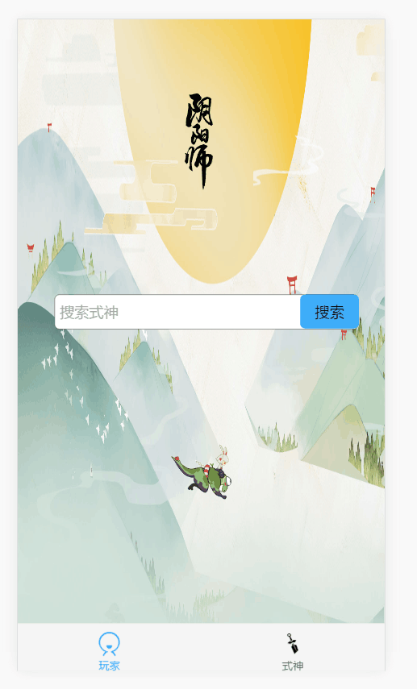
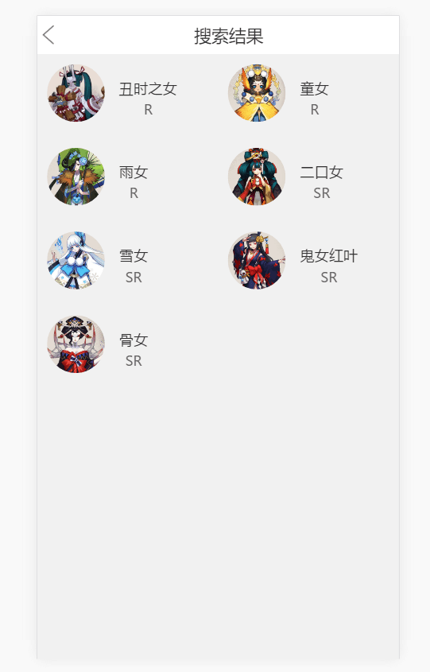
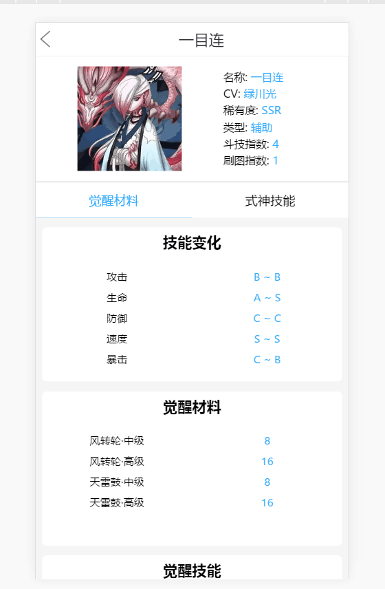

# yys-fe(阴阳师小助手)

> A Vue.js project

## 效果图






## 基本
    - 构建工具：webpack；
    - 语言：Es6；
    - 代码规范：eslint
    - 应用：vue，
         vuex（数据管理架构），
         vue-router（路由），
         mint-ui（ul组件），
         vue-axios（vue做的ajax请求）
## 目录结构

```
|-- [build]                         //构建服务和webpack配置
|-- [config]                        //项目不同环境的配置
|-- [dist]                          //文件服务器根目录  
|-- [node_modules]                  //项目依赖
|-- [src]                           //源码
|   |-- [assets]                    //资源文件
|   |-- [components]                //项目模块文件夹
|   |-- [store]                     //存储数据
|   |       |-- index.js            //vuex store 定义
|   |-- App.vue                     //主页面   
|   |-- main.js                     //webpack预编译入口
|   |-- [router]                    //全局路由定义
|-- .babelrc                        //babel配置
|-- .eslintrc.js                    //eslint rule 定义
|-- index.html                      //项目入口文件
|-- package.json                    //项目配置文件
|-- README.md                       //关于启动项目的命令和含义

```
## 已经完成的模块

- [x] 式神搜索页面(支持模糊搜索)
- [x] 式神搜索结果页面
- [x] 式神列表页面
- [x] 式神详细信息页面

## 待完成与优化

- [] 推荐御魂
- [] 推荐搭配

## Build Setup

``` bash
# install dependencies
npm install

# serve with hot reload at localhost:8080
npm run dev

# build for production with minification
npm run build

# build for production and view the bundle analyzer report
npm run build --report
```

For detailed explanation on how things work, checkout the [guide](http://vuejs-templates.github.io/webpack/) and [docs for vue-loader](http://vuejs.github.io/vue-loader).
